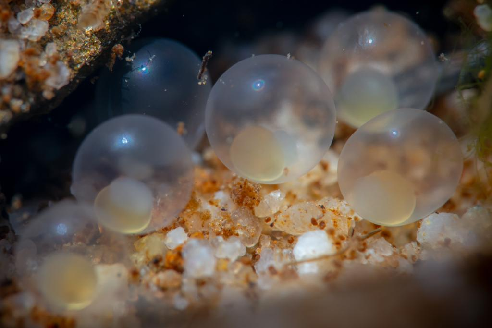

# Background

## Description
- Structure measurements of individual **woody** and **non-herbaceous** perennial plants, and mapped position of qualifying *woody* and *non-woody* plants.
- This should look like a second bullet point
- ~~This should be struck through~~

 

```{r, echo = TRUE, tidy = TRUE}
print('hello world!')
```

